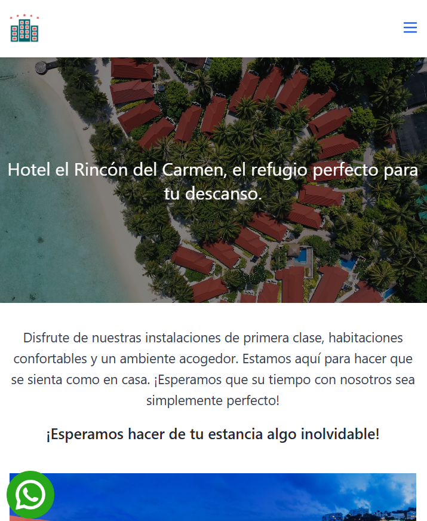
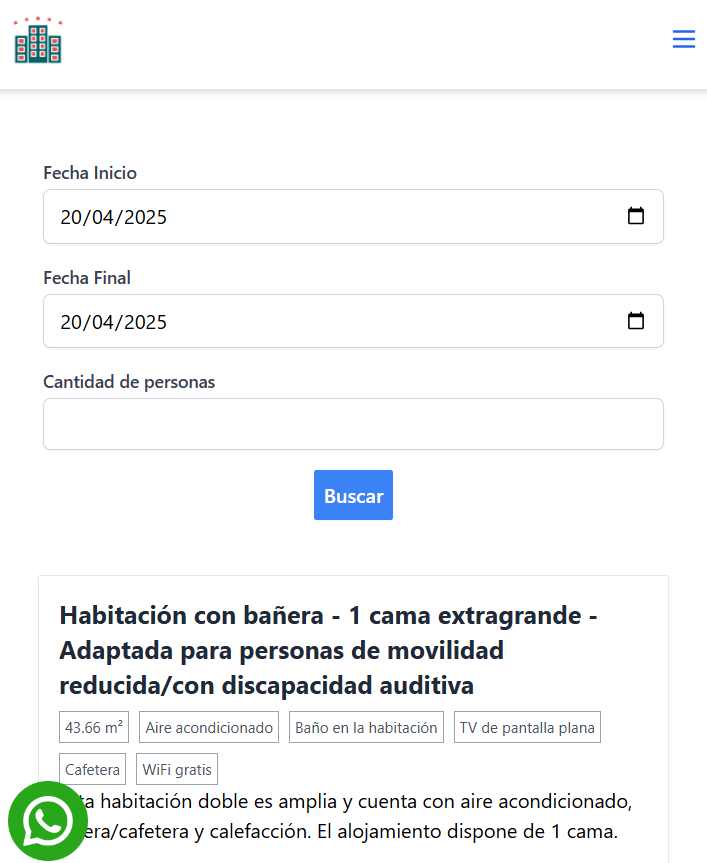
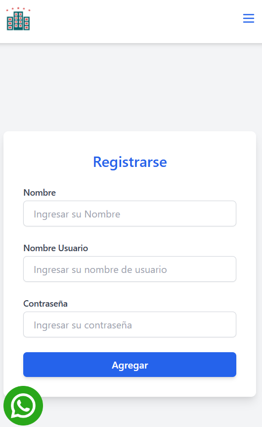
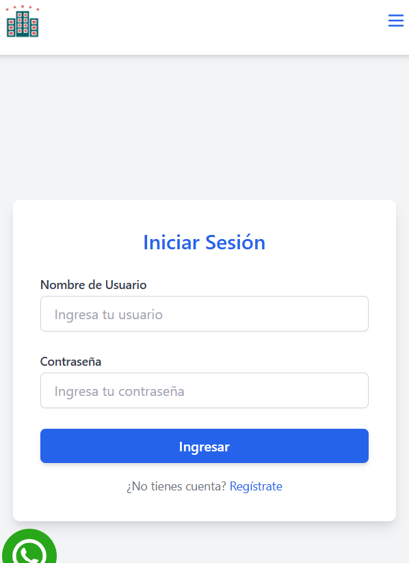
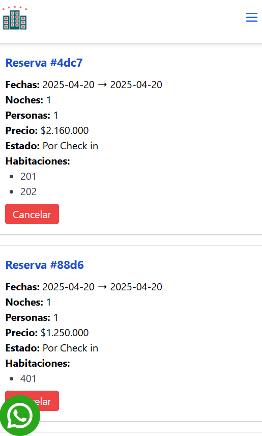

# Hotel El Rincón del Carmen

## Descripción

El proyecto **Hotel El Rincón del Carmen** es un sitio web sencillo, atractivo y funcional diseñado para aumentar la presencia en línea del hotel, atraer más clientes y facilitar la gestión de reservas de habitaciones. Este sitio está optimizado para dispositivos móviles, pero también es responsivo para otros dispositivos, ofreciendo una experiencia de usuario ágil y agradable.

El sitio cumple con los requerimientos establecidos, incluyendo una página de inicio tipo *landing page*, una sección para consultar disponibilidad y gestionar reservas, una página de contacto, y funcionalidades como un botón flotante de WhatsApp y un sistema de reservas exclusivo para usuarios registrados.

## Tecnologías Utilizadas

- **JavaScript**: Para la lógica del frontend, interacción con el usuario y gestión de solicitudes al servidor.
- **JSON-Server**: Para la persistencia de datos utilizando un archivo `db.json`.
- **Tailwind CSS**: Para el diseño responsivo, moderno y atractivo, optimizado para dispositivos móviles y otros dispositivos.
- **GitHub**: Para el control de versiones del proyecto.
- **GitHub Pages**: Para el despliegue del sitio web.

## Características

- **Página de Inicio (Landing Page)**: Incluye un carrusel de imágenes de habitaciones, áreas del hotel (como spa, zonas húmedas y restaurantes) y muestras fotográficas de servicios.
- **Consulta de Disponibilidad y Reservas**: Permite a los usuarios registrados buscar habitaciones disponibles según fechas y número de personas, mostrando detalles como precio, servicios (internet, minibar, jacuzzi, etc.) y la opción de reservar o cancelar.
- **Página de Contacto**: Muestra la ubicación del hotel, dirección y múltiples formas de contacto.
- **Botón Flotante de WhatsApp**: Presente en todas las páginas, se desplaza verticalmente y abre una nueva pestaña para contactar al hotel vía WhatsApp.
- **Registro de Usuarios**: Solo los usuarios registrados pueden realizar reservas o cancelaciones.
- **Optimización Móvil**: Diseño responsivo y ágil, priorizando la experiencia en dispositivos móviles.
- **Gestión de Reservas**: Proceso fácil para reservar o cancelar habitaciones, con información clara sobre precios y fechas.


## Instalación y Configuración

Sigue estos pasos para clonar, configurar y ejecutar el proyecto localmente:

### Prerrequisitos

- **Node.js**: Necesario para ejecutar `json-server` y otras herramientas. Descarga e instala la versión LTS desde nodejs.org (recomendada: 18.x o superior).
- **Visual Studio Code**: Recomendado para usar la extensión Live Server y ejecutar el archivo `index.html`.
- Git instalado.
- Un navegador web moderno.

### Pasos

1. **Instala Node.js**:

   - Descarga e instala Node.js desde https://nodejs.org/.

   - Verifica la instalación ejecutando:

     ```bash
     node -v
     npm -v
     ```

   - Deberías ver las versiones de Node.js y npm.

2. **Clona el repositorio**:

   # git clone https://github.com/ivillamizar5/hotel.git


3. **Instala JSON-Server** (si no está instalado globalmente):

   - Instala `json-server` globalmente:

     # npm install -g json-server

   - O usa la versión local (si está en las dependencias del proyecto):

     # npm install --save-dev json-server

4. **Configura JSON-Server**:

   - Asegúrate de tener un archivo `db.json` en la raíz del proyecto con la estructura de datos (usuarios, habitaciones, reservas, etc.).

   - Inicia JSON-Server con el siguiente comando:

     # json-server --watch db.json

   - Por defecto, JSON-Server se ejecutará en `http://localhost:3000`.

5. **Ejecuta** `index.html` **con Live Server**:

   - Abre la carpeta del proyecto en Visual Studio Code.
   - Instala la extensión **Live Server**:
     - Ve a la barra lateral de extensiones en VS Code.
     - Busca "Live Server" y haz clic en "Install".
   - Abre el archivo `index.html` (ubicado en la raíz del proyecto).
   - Haz clic derecho sobre `index.html` y selecciona **"Open with Live Server"**, o usa el botón "Go Live" en la barra inferior de VS Code.
   - Esto abrirá `index.html` en tu navegador, generalmente en `http://localhost:5500`.

6. **Accede al sitio**:

   - Navega a la URL proporcionada por Live Server para probar el sitio localmente.
   - Asegúrate de que `json-server` esté corriendo en otra terminal para que las solicitudes a `http://localhost:3000` funcionen.


7. **Visualización**












## Licencia

Este proyecto está bajo la Licencia MIT.